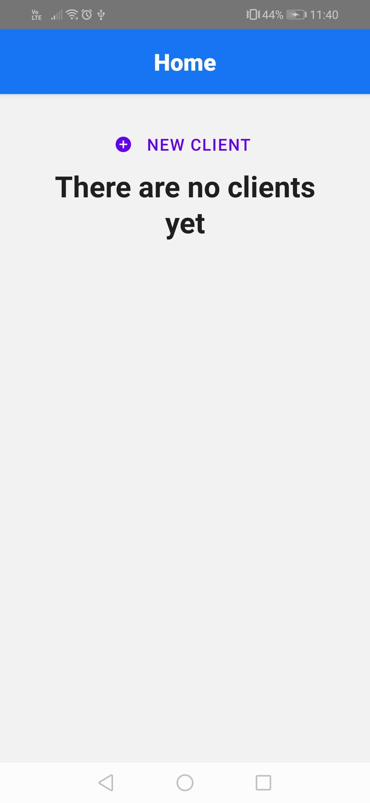
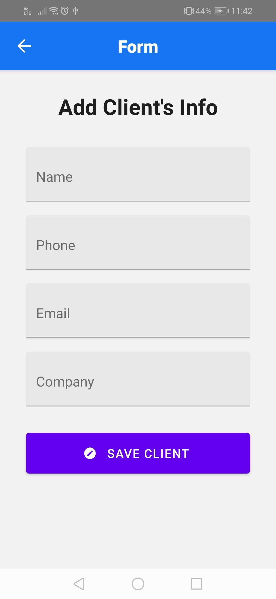
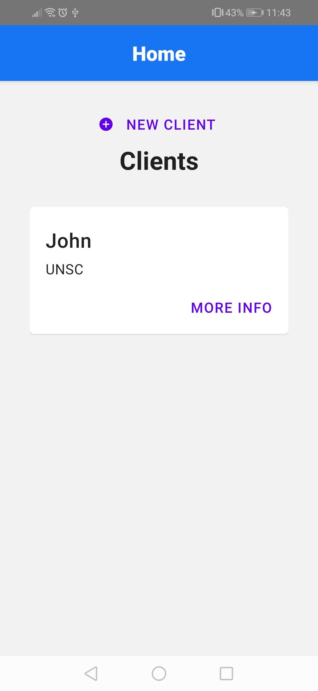
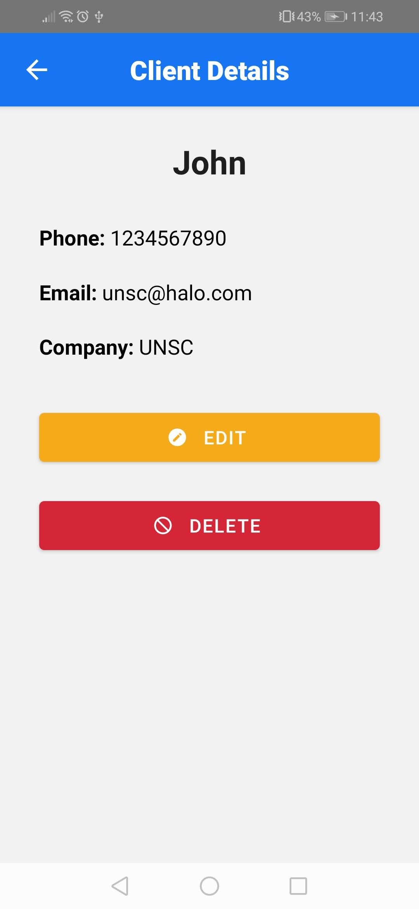
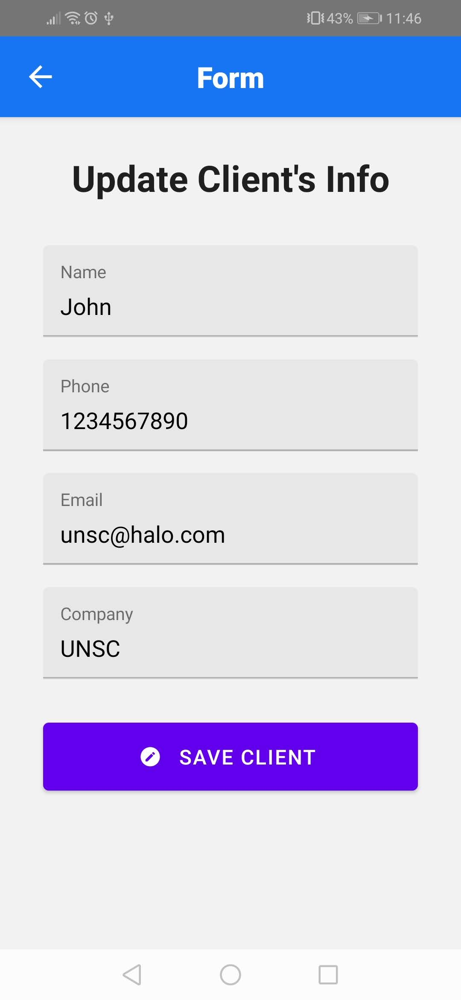
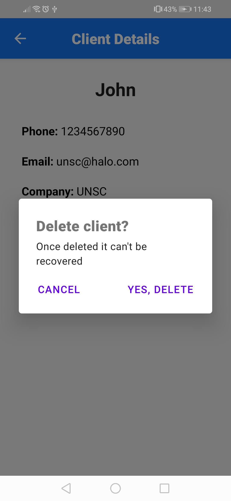

# CRUD_Navigation-RN
This application was created with React Native and React Navigation, tested in the Android version.

### Functionality
- Create, edit and delete clients
- Change between views thanks to react navigation
- Show all the data from the selected client
- JSON server to maintain the data

## Installation
To install this project follow the next steps:
1.  Download the repository found here: [GitHub Repository](https://github.com/SuaferoanTJK/CRUD_Navigation-RN)
2.  Run **npm install** script
3.  Check the endpoint file (inside the utils folder) to find if you need to change the IP value, also to be done in line 11 of the package.json
4.  Run **npm run db** script to raise the back server
5.  Run **npx react-native run-android** script to raise the development server.
6.  Watch the emergent emulator on your pc or your android cellphone (if the device is connected to the pc via USB and has developer mode enable).

## Screenshots

  
  
  
  
  
  

## Get in touch
### LinkedIn
https://www.linkedin.com/in/andrés-f-suárez/
